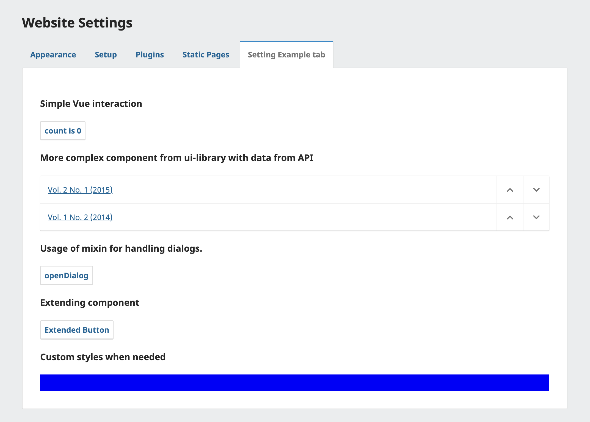

# Backend UI Example Plugin

Compatible with OJS 3.3. For version 3.4 check out stable-3_4_0 branch and for upcoming version 3.5, check main branch.

Example plugin to illustrate

- How to inject your own vue component to smarty template
- How to use components from ui-library (for 3.3 only small subset is available - Badge, Icon, PkpButton, Spinner, Tab, Tabs)
- How to do API data fetching
- How to extend existing ui-library component

Note that most of the ui-library components has been exposed in 3.4.0-2 (https://github.com/pkp/pkp-lib/issues/9089), so these won't be available in older versions. But you can still use this build your own Vue.js components for older versions following these examples.

Also check out generic plugin template https://github.com/pkp/pluginTemplate to see how the cypress test can be written to automatically test your plugin.

